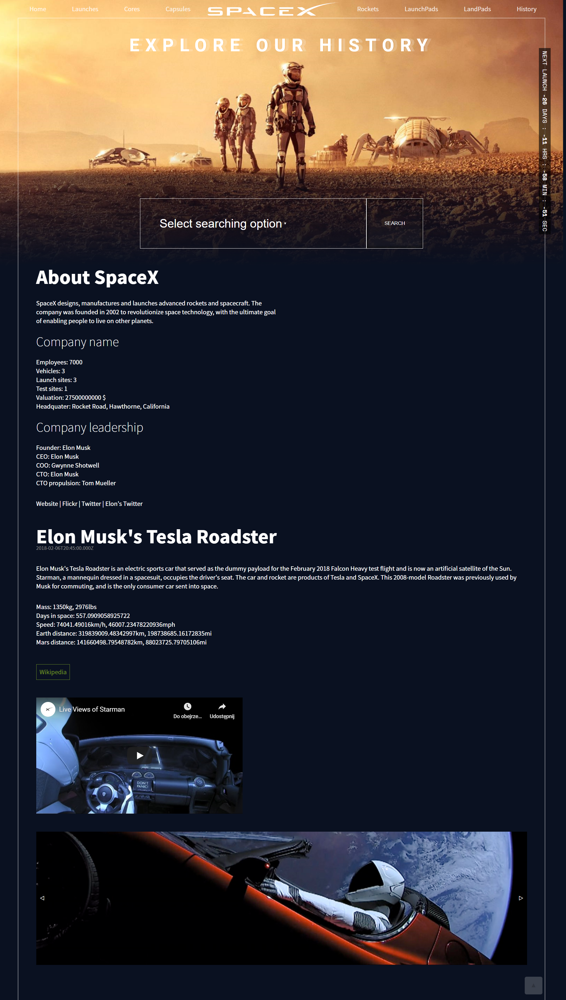

## Table of contents
* [General info](#general-info)
* [Technologies](#technologies)
* [Sources](#sources)
* [Inspiration](#inspiration)
* [Available Scripts](#available-scripts)
* [Screenshots](#screenshots)

# General info
First self made aplication in ReactJS technology. The main foundation was to create a working App based on SpaceX API. Aplication is aimed to present as much information as possible about SpaceX company. A simple layout made by hand outside the landing page, which was modeled on the design found on pinterest. I specially send big thank to SpaceX API creators for the possibility of using it in my own project.

## Technologies
Project is created with: 
* HTML5
* CSS 3
* ReactJS
* [SpaceX API](https://github.com/r-spacex/SpaceX-API)
* [Moment.js](https://momentjs.com/) 2.24.0

## Sources
* [SpaceX API](https://github.com/r-spacex/SpaceX-API)
* The Martian movie

## Inspiration
The inspiration to made that app is my interest of space and development of space technology. The main inspiration to create it was SpaceX company and its activities.

## Available Scripts
This project was bootstrapped with [Create React App](https://github.com/facebook/create-react-app).

In the project directory, you can run:

### `npm start`

Runs the app in the development mode. 
Open [http://localhost:3000](http://localhost:3000) to view it in the browser.

The page will reload if you make edits. 
You will also see any lint errors in the console.

### `npm test`

Launches the test runner in the interactive watch mode. 
See the section about [running tests](https://facebook.github.io/create-react-app/docs/running-tests) for more information.

### `npm run build`

Builds the app for production to the `build` folder. 
It correctly bundles React in production mode and optimizes the build for the best performance.

The build is minified and the filenames include the hashes. 
Your app is ready to be deployed!

## Screenshots

